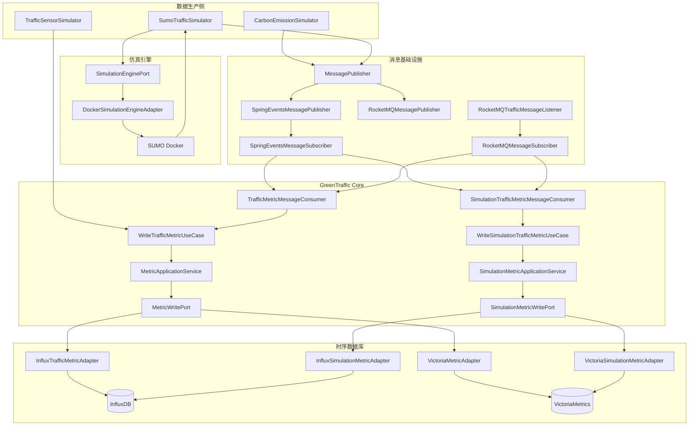
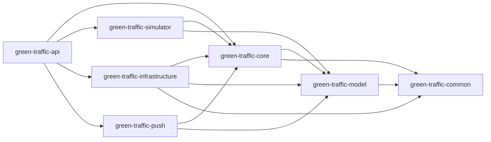
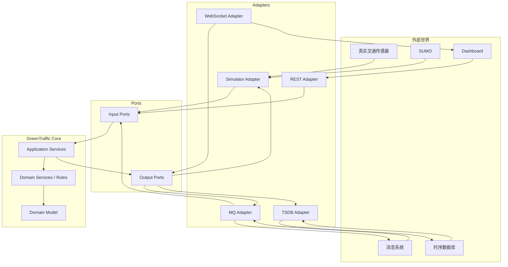

# GreenTraffic 城市交通碳排放实时监测与优化系统

> 迁移说明：仓库正在将旧的技术导向端口 `MetricWritePort`/`MetricQueryPort`/`SimulationMetricWritePort` 迁移为按业务能力命名的端口 `TrafficMetricStore` / `SimulationMetricStore`。详见项目根目录的 `MIGRATION_PORTS.md`。

## 系统架构现状评估、六边形架构设计、消息链路与后续开发规范

**文档版本：V2.1**  
**评审日期：2026-08-24**  
**评审对象：当前上传的 GreenTraffic 代码仓库**  
**目标架构：Hexagonal Architecture（Ports & Adapters）+ Event-Driven Architecture**  
**技术基础：Java 17 / Spring Boot 4 / Maven / Spring Events / RocketMQ / InfluxDB / VictoriaMetrics / SUMO**

> 已迁移通知：项目正在将旧端口术语 `MetricWritePort`/`MetricQueryPort`/`SimulationMetricWritePort` 标准化为能力端口 `TrafficMetricStore` / `SimulationMetricStore`。阅读 `MIGRATION_PORTS.md` 获取迁移细节与贡献指南。

---

# 1. 文档目的

本文档不是重新设计一套与当前代码脱节的架构，而是基于当前代码、已有架构文档和现有 `dev / vm` 配置，对 GreenTraffic 做一次“设计目标 → 当前实现 → 问题 → 演进方案”的完整收口。

重点回答以下问题：

1. 当前系统是否真正符合最初确定的“标准六边形架构”；
2. 当前 Maven Module 与 Java Package 应如何理解；
3. 当前系统真实架构图是什么；
4. Dev 与 VM 环境为什么可以使用不同基础设施，以及当前实现到什么程度；
5. `CarbonEmissionSimulator`、`SumoTrafficSimulator` 从数据生产到消息发布、监听、业务处理、时序数据库写入的完整链路；
6. 当前哪些地方只是“看起来像异步”，实际上仍是同步；
7. 后续增加数据源、消息系统、时序数据库、碳排放算法、优化算法时，新类应该放在哪个 Module / Package；
8. 如何把当前项目从“架构方向正确的原型”逐步收敛成“边界清晰、可替换、可测试、可生产化”的事件驱动六边形系统。

---

# 2. 先给出总体结论

## 2.1 架构方向是正确的，但还不是严格意义上的“完整标准六边形”

当前系统已经具备六边形架构最重要的骨架：

```text
                 外部技术
                     │
          ┌──────────┼──────────┐
          │          │          │
       Spring      RocketMQ    SUMO
       Events                   Docker
          │          │          │
          └──── Adapter /      │
                Subscriber ────┘
                     │
                  Port
                     │
              ┌──────▼──────┐
              │    Core     │
              │ Application │
              │   UseCase   │
              │   Domain    │
              └──────┬──────┘
                     │
                  Output Port
                     │
             ┌───────┼────────┐
             │       │        │
          InfluxDB   VM      其他TSDB
```

目前已经明确存在：

- `MessagePublisher`
- `MessageSubscriber`
- `SimulationEnginePort`
- `MetricWritePort`
- `MetricQueryPort`
- `SimulationMetricWritePort`
- Application Service
- Spring Events Adapter
- RocketMQ Adapter
- InfluxDB Adapter
- VictoriaMetrics Adapter
- Docker SUMO Adapter

因此，**“Port / Adapter”并不是停留在文档层面，而是已经进入代码实现。**

但是，如果按照“标准六边形架构”的严格标准继续检查，目前还有明显边界问题：

### 当前主要问题

1. `green-traffic-core` 仍然依赖 Spring / MyBatis / MySQL，Core 没有完全去基础设施化；
2. `Message`、`MessageSubscriber`等架构契约目前位于 `common`，Port 所有权不够清晰；
3. `green-traffic-simulator` 直接依赖 Core，这本身可以接受，但需要明确它属于“输入适配器 / 数据生产适配层”，而不是领域核心；
4. `publishAsync()` 已设计，但当前 `CarbonEmissionSimulator`、`SumoTrafficSimulator` 调用的都是 `publish()`；
5. Dev 的 Spring Events 当前 `publish()` 是同步事件分发，并非真正异步；
6. VM 环境的 RocketMQ Publisher 虽然有 `publishAsync()`，但当前仿真器没有使用它；
7. Consumer 从消息到 UseCase 的业务调用也是同步执行的，只有 MQ 客户端本身负责消息投递；
8. VictoriaMetrics 写入端已有批量队列和重试，但它是“性能缓冲”，不能替代 RocketMQ 的可靠消息能力；
9. 当前 `RocketMQMessageSubscriber` 存在 payload 反序列化适配逻辑，但消息 Schema 版本、幂等、DLQ、Trace 等生产能力还需要补齐。

因此建议将当前系统评价为：

> **六边形架构骨架已经成立，模块边界和异步可靠性仍需收口。**

如果按架构成熟度粗略评价：

| 维度 | 当前状态 | 评价 |
|---|---|---|
| Port / Adapter | 已建立 | 🟢 |
| Core 与 DB 解耦 | 部分完成 | 🟡 |
| Core 与 MQ 解耦 | 基本完成 | 🟢 |
| 仿真引擎可替换 | 已建立 | 🟢 |
| TSDB 可替换 | 已建立 | 🟢 |
| Dev / VM 基础设施切换 | 已建立 | 🟢 |
| 真正异步 | 尚未完全实现 | 🟠 |
| 消息可靠性 | 原型级 | 🟠 |
| 幂等 / DLQ | 缺失 | 🔴 |
| 可观测性 | 基础日志 | 🟡 |
| Core 纯 Java 化 | 未完成 | 🟠 |
| 模块职责清晰度 | 基本成立但有混杂 | 🟡 |

---

# 3. GreenTraffic 的正确架构思想

GreenTraffic 最重要的不是“使用了哪些技术”，而是下面这个依赖原则：

```text
业务决定“做什么”
        ↓
Port 定义“需要什么能力”
        ↓
Adapter 决定“怎么实现”
        ↓
基础设施负责“与外部世界交互”
```

例如：

```text
Core：

我要把交通指标写入时序数据库
        ↓
MetricWritePort
```

Core 不应该知道：

```text
InfluxDB
VictoriaMetrics
TDengine
IoTDB
TimescaleDB
```

Infrastructure 才负责：

```text
MetricWritePort
       ▲
       │
 ┌─────┼─────────┐
 │     │         │
Influx   VM     TDengine
```

同样：

```text
Core：

我要发布交通指标消息
        ↓
MessagePublisher
```

而 Infrastructure 决定：

```text
MessagePublisher
       ▲
       │
 ┌─────┴─────────┐
 │               │
Spring Events   RocketMQ
```

这就是 GreenTraffic 的核心设计思想：

> **技术是可替换的，业务能力是稳定的。**

---

# 4. 当前 Maven Module 架构

当前 Maven Modules：

```text
green-traffic
│
├── green-traffic-common
├── green-traffic-model
├── green-traffic-simulator
├── green-traffic-core
├── green-traffic-push
├── green-traffic-api
└── green-traffic-infrastructure
```

另外还有非 Maven 运行模块：

```text
green-traffic-dashboard
green-traffic-doc
sumo-work
scripts
```

## 4.1 当前各 Module 的实际职责

### green-traffic-common

当前承担：

```text
Message
MessageSubscriber
TrafficMessageTypes
ApiResponse
TimezoneUtils
AlertMessage
```

问题：

`common` 正在同时承担：

- 通用工具；
- API 契约；
- 消息契约；
- 领域模型；
- Port 依赖基础。

长期来看容易变成“大杂烩模块”。

---

### green-traffic-model

理论职责应该是：

```text
领域模型
值对象
领域实体
```

当前已经有：

```text
EnergyRecord
BaseEntity
SimulationTrafficMetric
```
---

### green-traffic-core

这是整个系统最重要的模块。

当前已经存在：

```text
application
port/input
port/output
```

这是正确方向。

建议继续收敛为：

```text
green-traffic-core
└── com.greentraffic.core
    ├── application
    ├── domain
    │   ├── carbon
    │   ├── traffic
    │   ├── optimization
    │   └── alert
    └── port
        ├── input
        └── output
```

---

### green-traffic-simulator

它不是业务 Core。

它应该被理解为：

> **外部数据源 / 仿真数据生产输入适配器。**

当前：

```text
CarbonEmissionSimulator
SumoTrafficSimulator
TrafficSensorSimulator
```

属于数据生产侧。

推荐长期结构：

```text
green-traffic-simulator
└── com.greentraffic.simulator
    ├── carbon
    ├── sumo
    ├── sensor
    └── scheduling
```

---

### green-traffic-infrastructure

当前负责：

```text
Messaging
Persistence
Simulation Adapter
Config
```

这是合理的。

建议最终：

```text
green-traffic-infrastructure
└── com.greentraffic.infrastructure
    ├── messaging
    │   ├── springevents
    │   └── rocketmq
    ├── persistence
    │   ├── influxdb
    │   └── victoriametrics
    ├── simulation
    │   └── sumo
    └── config
```

如果未来基础设施数量继续扩大，再考虑拆成：

```text
green-traffic-infra-messaging
green-traffic-infra-influxdb
green-traffic-infra-victoriametrics
green-traffic-infra-sumo
```

当前阶段没有必要马上拆 Module，先把 Package 边界做正确。

---

### green-traffic-api

这是当前应用的 Composition Root。

它负责：

```text
REST
Spring Boot 启动
依赖装配
Profile
配置
Actuator
```

它可以依赖：

```text
core
simulator
infrastructure
push
model
common
```

但 Controller 本身不应该直接访问：

```text
InfluxDBClient
RocketMQTemplate
RestTemplate
```

---

### green-traffic-push

目前基本属于预留模块。

未来建议：

```text
WebSocket
SSE
实时广播
告警推送
Dashboard 推送
```

它应该是一个：

> **Inbound / Outbound UI Adapter**

而不是把业务逻辑放进去。

---

# 5. 当前系统真实架构图



---

# 6. `CarbonEmissionSimulator` 完整数据链路

当前代码的核心流程：

```text
@Scheduled
     │
     ▼
CarbonEmissionSimulator
     │
     ├── 随机生成 vehicleCount
     ├── 随机生成 speed
     ├── 计算 co2
     └── 生成 TrafficMetric
              │
              ▼
TrafficMessageTypes.CO2_EMISSION
              │
              ▼
MessagePublisher.publish()
              │
       ┌──────┴───────┐
       │              │
     Dev              VM
       │              │
Spring Events       RocketMQ
       │              │
       └──────┬───────┘
              ▼
TrafficMetricMessageConsumer
              │
              ▼
WriteTrafficMetricUseCase
              │
              ▼
MetricApplicationService
              │
              ▼
MetricWritePort
              │
       ┌──────┴────────┐
       │               │
    InfluxDB      VictoriaMetrics
```

## 6.1 当前最重要的事实

虽然接口存在：

```java
void publishAsync(Message<?> message);
```

但 `CarbonEmissionSimulator` 当前调用的是：

```java
messagePublisher.publish(msg);
```

所以当前不能称为：

> Simulator 真正异步发送。

应该准确描述为：

> **Simulator 通过消息抽象发布消息，具体消息基础设施由环境决定；当前默认调用路径仍为同步 publish。**

---

# 7. `SumoTrafficSimulator` 完整数据链路

当前实际链路：

```text
Scheduled
   │
   ▼
SumoTrafficSimulator
   │
   ▼
SimulationEnginePort
   │
   ▼
DockerSimulationEngineAdapter
   │
   ▼
docker run SUMO
   │
   ├── 生成 network
   ├── 生成 route
   ├── 生成 simulation config
   ├── 执行 SUMO
   └── 生成 tripinfo.xml
            │
            ▼
      parseTripInfo()
            │
            ▼
      List<SumoTripInfo>
            │
            ▼
      SumoTrafficMetricMapper
            │
            ▼
 SimulationTrafficMetric
            │
            ▼
MessagePublisher.publish()
            │
            ▼
TRAFFIC_DATA_BATCH
            │
       ┌────┴─────┐
       │          │
      Dev         VM
       │          │
Spring Events   RocketMQ
       │          │
       └────┬─────┘
            ▼
SimulationTrafficMetricMessageConsumer
            │
            ▼
WriteSimulationTrafficMetricUseCase
            │
            ▼
SimulationMetricApplicationService
            │
            ▼
SimulationMetricWritePort
            │
       ┌────┴─────────┐
       │              │
    InfluxDB     VictoriaMetrics
```

## 7.1 SUMO 的六边形价值

当前：

```java
SimulationEnginePort
```

已经是一个非常重要的抽象。

它意味着 Core / Simulator 不需要知道：

```text
SUMO 是 Docker
SUMO 是本机
SUMO 是远程服务器
SUMO 是 CityFlow
SUMO 是 MATSim
```

只需要：

```java
List<SumoTripInfo> run(SumoSimulationRequest request);
```

未来可以增加：

```text
LocalSumoSimulationAdapter
RemoteSumoSimulationAdapter
CityFlowSimulationAdapter
MatSimSimulationAdapter
```

而不需要修改上层 UseCase。

---

# 8. Dev 环境设计

当前 Dev：

```yaml
messaging:
  type: events

traffic:
  storage:
    type: influx
```

因此：

```text
Producer
   ↓
MessagePublisher
   ↓
SpringEventsMessagePublisher
   ↓
ApplicationEventPublisher
   ↓
SpringEventsMessageSubscriber
   ↓
MessageConsumer
   ↓
Core UseCase
   ↓
MetricWritePort
   ↓
InfluxTrafficMetricAdapter
   ↓
InfluxDB
```

## 8.1 Dev 的优点

开发环境不需要启动：

```text
RocketMQ NameServer
RocketMQ Broker
```

因此可以快速启动。

这非常适合：

- 单元测试；
- 本地开发；
- Demo；
- 快速调试；
- IDE 单进程运行。

## 8.2 当前 Dev 的关键限制

`ApplicationEventPublisher.publishEvent()` 当前调用路径是同步的。

也就是说：

```text
Simulator
 ↓
publish
 ↓
EventListener
 ↓
Consumer
 ↓
UseCase
 ↓
InfluxDB
```

会处于同一调用链中。

因此当前 Dev 更准确地说是：

> **进程内事件驱动，而不是可靠异步消息系统。**

如果要实现真正异步：

```text
Simulator
   │
   ▼
MessagePublisher.publishAsync()
   │
   ▼
TaskExecutor
   │
   ▼
Spring Event
```

并且要解决：

```text
线程池大小
队列长度
拒绝策略
异常处理
优雅停机
```

---

# 9. VM 环境设计

当前 VM：

```yaml
messaging:
  type: rocketmq

traffic:
  storage:
    type: victoria-metrics
```

链路：

```text
Simulator
   │
   ▼
MessagePublisher
   │
   ▼
RocketMQMessagePublisher
   │
   ▼
RocketMQ Broker
   │
   ▼
RocketMQTrafficMessageListener
   │
   ▼
RocketMQMessageSubscriber
   │
   ▼
normalizeMetricPayload()
   │
   ▼
TrafficMetricMessageConsumer
   │
   ▼
WriteTrafficMetricUseCase
   │
   ▼
MetricApplicationService
   │
   ▼
MetricWritePort
   │
   ▼
VictoriaMetricAdapter
   │
   ▼
BlockingQueue
   │
   ▼
Batch Flush
   │
   ▼
VictoriaMetrics HTTP API
```

## 9.1 RocketMQ 的意义

这里 RocketMQ 才是真正意义上的：

```text
生产者
   ↓
消息 Broker
   ↓
消费者
```

因此 Producer 与 Consumer 在进程、线程、机器上都可以进一步解耦。

---

# 10. 当前“异步”与目标“异步”的区别

这是本系统当前最需要在文档里说清楚的概念。

## 当前状态

### Dev

```text
publish()
 ↓
Spring Event
 ↓
同步 Listener
 ↓
Core
 ↓
DB
```

### VM

```text
publish()
 ↓
syncSend()
 ↓
RocketMQ
 ↓
Consumer
 ↓
Core
 ↓
VM Adapter Queue
 ↓
批量写入
```

因此当前系统实际上是：

```text
Dev：同步事件
VM：消息 Broker + 同步发送 + 异步消费 + 异步批量写 TSDB
```

而不是：

```text
全链路异步
```

---

# 11. 建议的目标异步架构

未来建议统一成：

```text
                Producer
                   │
                   ▼
           MessagePublisher
                   │
              publishAsync
                   │
          ┌────────┴────────┐
          │                 │
       Dev                 VM
          │                 │
   Async Spring Event    RocketMQ Async
          │                 │
          └────────┬────────┘
                   ▼
               Consumer
                   │
                   ▼
               UseCase
                   │
                   ▼
              WritePort
                   │
                   ▼
            Async Buffer
                   │
                   ▼
                TSDB
```

但需要强调：

> **“异步”不是越多越好。**

业务 UseCase 不应该被无意义地套多层异步。

推荐只在两个边界异步：

1. 消息 Broker 边界；
2. 高吞吐时序数据库批量写边界。

Core 内部保持同步、确定性、可测试。

---

# 12. 当前六边形架构中最需要整改的地方

## P0：真正的异步发送

当前：

```java
messagePublisher.publish(message);
```

目标：

```java
messagePublisher.publishAsync(message);
```

新增：

```text
SpringEventsAsyncMessagePublisher
```

或在现有 Publisher 内部实现真正的异步策略。

推荐包：

```text
green-traffic-infrastructure
└── messaging
    └── springevents
        └── AsyncSpringEventsMessagePublisher
```

---

## P0：消息可靠性

VM 环境需要补：

```text
Retry
ACK
DLQ
Idempotency
Replay
```

目标：

```text
RocketMQ
   ↓
Consumer
   ↓
Idempotency
   ↓
UseCase
   ↓
TSDB
   │
   ├── Success → ACK
   │
   └── Failure
        ↓
      Retry
        ↓
       DLQ
```

新增类建议：

```text
green-traffic-infrastructure
└── messaging
    └── rocketmq
        ├── consumer
        │   ├── RocketMQMessageSubscriber
        │   ├── RocketMQTrafficMessageListener
        │   └── RocketMQConsumeErrorHandler
        ├── retry
        │   └── MessageRetryPolicy
        └── idempotency
            └── MessageIdempotencyStore
```

`MessageIdempotencyStore` 如果未来需要 Redis / MySQL，应由 Core 定义 Port：

```text
core.port.output.messaging.MessageIdempotencyPort
```

Infrastructure 实现：

```text
infrastructure.messaging.idempotency.RedisMessageIdempotencyAdapter
```

---

# 13. Message 模型建议升级

当前：

```text
messageId
messageType
topic
tag
key
payload
headers
timestamp
```

已经具备基础结构。

建议增加：

```text
schemaVersion
source
traceId
correlationId
```

目标：

```java
Message<T>
├── messageId
├── messageType
├── schemaVersion
├── source
├── traceId
├── correlationId
├── topic
├── tag
├── key
├── timestamp
├── headers
└── payload
```

这样以后可以追踪：

```text
SUMO simulation
 ↓
messageId
 ↓
RocketMQ
 ↓
Consumer
 ↓
Core
 ↓
TSDB
```

---

# 14. Core 去 Spring 化

当前 Core 中：

```java
@Service
public class MetricApplicationService
```

以及 POM 中：

```text
spring-boot-starter
mybatis
mysql
```

从严格六边形架构来说，这不是理想状态。

目标：

```text
green-traffic-core
```

只依赖：

```text
green-traffic-model
必要的纯 Java 基础库
```

ApplicationService 最终：

```java
public class MetricApplicationService
        implements WriteTrafficMetricUseCase {
}
```

Bean 装配放到 Infrastructure / API：

```text
MetricApplicationServiceConfiguration
```

这样：

```text
Core
  ↓
纯 Java
```

未来即使换：

```text
Spring
Quarkus
Micronaut
原生 Java
```

业务仍然成立。

---

# 15. Port 的正确归属

## 推荐目标结构

```text
green-traffic-core
└── com.greentraffic.core
    └── port
        ├── input
        │   ├── WriteTrafficMetricUseCase
        │   ├── QueryTrafficMetricUseCase
        │   ├── WriteSimulationTrafficMetricUseCase
        │   └── ...
        │
        └── output
            ├── MetricWritePort
            ├── MetricQueryPort
            ├── SimulationMetricWritePort
            ├── MessagePublisher
            ├── SimulationEnginePort
            └── ...
```

当前 `MessagePublisher` 已经位于 Core，这是正确的。

建议将：

```text
MessageSubscriber
TrafficMessageTypes
```

重新审视归属。

推荐：

```text
MessageEnvelope / MessageType
```

属于共享消息契约；

而：

```text
MessagePublisher
MessageIdempotencyPort
```

属于 Core Output Port。

---

# 16. Simulator 与 Core 的正确边界

## 当前 CarbonEmissionSimulator

目前同时做：

```text
模拟数据生成
CO2 计算
消息发布
```

未来建议：

```text
CarbonEmissionSimulator
        │
        ▼
TrafficSample
        │
        ▼
CarbonEmissionCalculationUseCase
        │
        ▼
CarbonEmissionCalculator
        │
        ▼
TrafficMetric
```

这样：

```text
SUMO
Camera
GPS
Sensor
Simulator
```

都可以复用同一个：

```text
CarbonEmissionCalculator
```

---

# 17. 碳排放算法应该放在哪里？

不要放：

```text
simulator
```

也不要放：

```text
infrastructure
```

推荐：

```text
green-traffic-core
└── domain
    └── carbon
        ├── CarbonEmissionCalculator.java
        ├── CarbonEmissionFactor.java
        ├── CarbonEmissionResult.java
        └── CarbonEmissionPolicy.java
```

如果算法需要读取外部排放因子：

```text
core
└── port
    └── output
        └── carbon
            └── EmissionFactorQueryPort
```

Infrastructure：

```text
infrastructure
└── persistence
    └── carbon
        └── MySqlEmissionFactorAdapter
```

---

# 18. SUMO Adapter 应放哪里？

当前：

```text
green-traffic-infrastructure
└── simulation
    └── DockerSimulationEngineAdapter
```

这个方向是正确的。

建议最终：

```text
green-traffic-infrastructure
└── simulation
    └── sumo
        ├── DockerSumoSimulationAdapter
        ├── LocalSumoSimulationAdapter
        ├── RemoteSumoSimulationAdapter
        ├── SumoProcessExecutor
        └── SumoTripInfoParser
```

其中：

```text
SimulationEnginePort
```

属于：

```text
green-traffic-core
```

而：

```text
DockerSumoSimulationAdapter
```

属于：

```text
green-traffic-infrastructure
```

---

# 19. LocalSumoSimulationAdapter 当前状态

当前：

```java
public class LocalSumoSimulationAdapter {
}
```

还是空实现。

因此当前真正可工作的 SUMO Adapter 是：

```text
DockerSimulationEngineAdapter
```

建议不要保留一个“看起来已经支持本地 SUMO”的空类。

两种选择：

### 方案 A：暂时删除

等真正实现时再加入。

### 方案 B：明确标记为未来实现

```text
@Profile("local-sumo")
```

并补充接口测试。

推荐方案 A，避免产生“能力已存在”的误导。

---

# 20. VictoriaMetrics 当前设计评价

当前：

```text
MetricWritePort
       ↓
VictoriaMetricAdapter
       ↓
BlockingQueue
       ↓
Batch
       ↓
HTTP
       ↓
VictoriaMetrics
```

这个方向合理。

但必须明确：

> BlockingQueue 是写性能缓冲，不是消息可靠性组件。

如果 JVM：

```text
Crash
```

内存中的：

```text
queue
```

数据可能丢失。

因此可靠性由：

```text
RocketMQ
```

负责。

VictoriaMetrics Adapter 只负责：

```text
批量
重试
HTTP
协议转换
```

---

# 21. InfluxDB 与 VictoriaMetrics 的统一抽象

Core 不应该出现：

```text
Influx
Victoria
```

只能看到：

```text
MetricWritePort
MetricQueryPort
SimulationMetricWritePort
```

所以：

```text
Core
   │
   ├── MetricWritePort
   │       ├── InfluxTrafficMetricAdapter
   │       └── VictoriaMetricAdapter
   │
   └── SimulationMetricWritePort
           ├── InfluxSimulationMetricAdapter
           └── VictoriaSimulationMetricAdapter
```

这个部分是当前架构中做得比较好的地方，应保持。

---

# 22. VictoriaMetrics 查询模型需要重点整改

当前 VM 写入使用：

```text
Influx Line Protocol
```

但查询侧又按：

```text
PromQL
```

解释结果。

这会产生一个关键问题：

> 写入的数据模型与查询的数据模型没有形成一个明确、稳定的契约。

建议定义：

```text
VictoriaMetricsMetricSchema
```

并明确：

```text
metric name
labels
fields
timestamp
```

例如：

```text
traffic_metric_traffic_flow
traffic_metric_average_speed
traffic_metric_co2_emission
```

标签：

```text
roadId
direction
vehicleType
location
```

然后查询时再聚合成：

```text
~~MetricPoint~~（已迁移为域对象 `TrafficMetric`）
```

这项建议列为 P1。

---

# 23. 时序数据模型规范

建议统一所有交通指标的核心维度：

```text
timestamp
source
cityId
areaId
roadId
laneId
direction
vehicleType
simulationId
```

实时指标：

```text
TrafficMetric
├── roadId
├── direction
├── vehicleType
├── trafficFlow
├── averageSpeed
├── co2Emission
├── location
└── timestamp
```

仿真指标：

```text
SimulationTrafficMetric
├── simulationId
├── roadId
├── direction
├── vehicleType
├── vehicleCount
├── averageSpeed
├── totalCo2Emission
├── averageTravelTime
├── averageWaitingTime
├── averageTimeLoss
├── totalRouteLength
└── timestamp
```

---

# 24. 新增功能应该如何判断放哪个 Module？

这是后续开发必须严格执行的规则。

## 规则 1：业务规则 → Core

例如：

```text
拥堵判定
碳排放计算
碳排放预测
优化策略
告警规则
交通评分
```

全部：

```text
green-traffic-core
```

---

## 规则 2：外部技术 → Infrastructure

例如：

```text
InfluxDB
VictoriaMetrics
RocketMQ
Redis
MySQL
SUMO Docker
Kafka
RabbitMQ
```

全部：

```text
green-traffic-infrastructure
```

---

## 规则 3：HTTP / WebSocket / REST → API / Push

REST：

```text
green-traffic-api
```

WebSocket：

```text
green-traffic-push
```

---

## 规则 4：数据模型 → Model

例如：

```text
TrafficMetric
SimulationTrafficMetric
EmissionFactor
TrafficState
OptimizationPlan
```

放：

```text
green-traffic-model
```

但如果一个对象本质上是业务行为，而不是数据结构，则应该进入 Core Domain。

---

# 25. 后续功能开发目录规范

推荐：

```text
green-traffic-core
└── com.greentraffic.core
    ├── application
    │   ├── TrafficMetricApplicationService
    │   ├── CarbonEmissionApplicationService
    │   ├── TrafficOptimizationApplicationService
    │   └── TrafficPredictionApplicationService
    │
    ├── domain
    │   ├── traffic
    │   ├── carbon
    │   ├── optimization
    │   ├── prediction
    │   └── alert
    │
    └── port
        ├── input
        └── output
```

---

# 26. 新增“交通拥堵识别”功能

建议：

```text
core
├── application
│   └── CongestionAnalysisApplicationService
├── domain
│   └── traffic
│       ├── CongestionLevel.java
│       └── CongestionAnalyzer.java
└── port
    └── input
        └── AnalyzeCongestionUseCase.java
```

如果需要历史数据：

```text
core.port.output.MetricQueryPort
```

不要直接：

```java
InfluxDBClient
```

---

# 27. 新增“碳排放预测”功能

推荐：

```text
core
├── application
│   └── CarbonEmissionPredictionApplicationService
├── domain
│   └── prediction
│       ├── PredictionModel.java
│       ├── PredictionResult.java
│       └── CarbonEmissionPredictor.java
└── port
    └── output
        └── prediction
            └── PredictionModelPort.java
```

Infrastructure：

```text
infrastructure
└── prediction
    ├── PythonPredictionAdapter
    ├── ONNXPredictionAdapter
    └── RemotePredictionServiceAdapter
```

这样算法模型可以替换。

---

# 28. 新增“交通优化”功能

核心：

```text
core.domain.optimization
```

例如：

```text
TrafficOptimizationStrategy
SignalTimingOptimization
LaneOptimization
RouteOptimization
OptimizationResult
```

如果以后接：

```text
SUMO
信号控制器
交通信号平台
```

通过 Output Port：

```text
TrafficControlPort
```

实现。

---

# 29. 新增“告警”功能

Core：

```text
core.domain.alert
```

Input：

```text
CreateTrafficAlertUseCase
```

Output：

```text
AlertPublisherPort
```

Infrastructure：

```text
infrastructure.messaging
```

可以实现：

```text
RocketMQAlertPublisher
WebSocketAlertPublisher
EmailAlertPublisher
```

---

# 30. 推荐的最终模块依赖



但是目标应该逐渐演进成：

```text
                     API / Push / Simulator
                              │
                              ▼
                            Core
                              │
                         Port / Interface
                              ▲
                              │
                         Infrastructure
```

也就是说：

> **Infrastructure 实现 Core 的 Port，而不是 Core 使用 Infrastructure。**

---

# 31. 未来标准消息链路

建议统一成：

```text
┌─────────────────────┐
│ Data Producer       │
│                     │
│ Sensor / SUMO / IoT │
└──────────┬──────────┘
           │
           ▼
   MessagePublisher
           │
           ▼
    MessageEnvelope
           │
     ┌─────┴─────┐
     │           │
   Dev           VM
     │           │
Async Event    RocketMQ
     │           │
     └─────┬─────┘
           ▼
      MessageConsumer
           │
           ▼
       Validate
           │
           ▼
     Idempotency
           │
           ▼
        Command
           │
           ▼
        UseCase
           │
           ▼
       Domain Logic
           │
           ▼
        Output Port
           │
           ▼
    Persistence Adapter
           │
           ▼
          TSDB
```

---

# 32. 消息消费者的职责边界

Consumer 只能负责：

```text
1. 接收
2. 基础校验
3. Payload 转换
4. Command 构造
5. 调用 UseCase
```

不能负责：

```text
❌ 碳排放算法
❌ 拥堵判断
❌ 直接访问 InfluxDB
❌ 直接访问 VM
❌ 执行 SUMO
❌ 优化算法
```

---

# 33. 推荐的 Consumer 结构

```java
public void consume(Message<?> message) {

    validate(message);

    TrafficMetric metric =
        messageConverter.toTrafficMetric(message);

    WriteTrafficMetricCommand command =
        WriteTrafficMetricCommand.from(metric);

    useCase.write(command);
}
```

如果消息转换复杂：

```text
infrastructure.messaging.converter
```

不要塞进 Consumer。

---

# 34. 推荐新增 MessageConverter

当前 `RocketMQMessageSubscriber` 里存在：

```text
normalizeMetricPayload()
```

建议后续拆成：

```text
green-traffic-infrastructure
└── messaging
    └── converter
        ├── TrafficMessageConverter
        └── SimulationTrafficMessageConverter
```

这样：

```text
RocketMQ
Spring Events
Kafka
RabbitMQ
```

都可以复用相同转换逻辑。

---

# 35. Profile 设计规范

建议统一：

```text
dev
test
vm
prod
```

不要把：

```text
dev = Spring Events
test = RocketMQ
prod = RocketMQ
```

这种语义写死在类名注释里。

真正的判断标准应该是：

```yaml
messaging:
  type: events
```

或者：

```yaml
messaging:
  type: rocketmq
```

存储：

```yaml
traffic:
  storage:
    type: influx
```

或：

```yaml
traffic:
  storage:
    type: victoria-metrics
```

环境是部署属性，基础设施类型是架构属性，两者应该可以独立组合。

---

# 36. 推荐的配置组合

例如：

### 本地开发

```yaml
messaging:
  type: events

traffic:
  storage:
    type: influx
```

### VM 集成环境

```yaml
messaging:
  type: rocketmq

traffic:
  storage:
    type: victoria-metrics
```

### 生产环境

```yaml
messaging:
  type: rocketmq

traffic:
  storage:
    type: victoria-metrics
```

### 未来私有云

```yaml
messaging:
  type: rabbitmq

traffic:
  storage:
    type: tdengine
```

Core 不改。

---

# 37. 数据可靠性设计

生产环境目标：

```text
At-least-once
```

配合：

```text
Idempotent Consumer
```

实现最终效果：

```text
消息允许重复
业务结果不能重复
```

关键字段：

```text
messageId
```

必要时：

```text
businessKey
```

例如：

```text
simulationId + roadId + timestamp
```

---

# 38. 幂等设计

建议 Core 定义：

```java
public interface MessageIdempotencyPort {

    boolean alreadyProcessed(String messageId);

    void markProcessed(String messageId);
}
```

Infrastructure：

```text
RedisMessageIdempotencyAdapter
MySqlMessageIdempotencyAdapter
```

Consumer：

```text
收到消息
   ↓
alreadyProcessed?
   ├── yes → ACK / Ignore
   └── no
        ↓
      UseCase
        ↓
   markProcessed
```

如果要求严格一致性，幂等记录与业务落库需要结合事务 / Outbox / Inbox Pattern 进一步设计。

---

# 39. Outbox / Inbox 的演进方向

如果未来 GreenTraffic 从“监测系统”进入“控制系统”，建议逐步采用：

```text
Inbox Pattern
```

处理：

```text
RocketMQ
   ↓
Inbox
   ↓
UseCase
```

保证：

```text
消息已消费
业务状态已记录
```

不会因为 ACK / DB 写入顺序问题产生重复业务。

---

# 40. 监控与链路追踪

每条消息建议至少记录：

```text
messageId
traceId
source
messageType
simulationId
timestamp
```

日志：

```text
traceId=xxx
messageId=xxx
simulationId=xxx
messageType=traffic.data.batch
```

这样可以从：

```text
SUMO
```

一直追踪到：

```text
VictoriaMetrics
```

---

# 41. 测试策略

必须形成四层测试。

## 第一层：Domain Test

例如：

```text
CarbonEmissionCalculatorTest
CongestionAnalyzerTest
OptimizationStrategyTest
```

不启动 Spring。

---

## 第二层：Application Test

例如：

```text
MetricApplicationServiceTest
SimulationMetricApplicationServiceTest
```

使用 Mock Port。

---

## 第三层：Infrastructure Test

例如：

```text
InfluxTrafficMetricAdapterTest
VictoriaMetricAdapterTest
RocketMQMessageSubscriberTest
DockerSimulationEngineAdapterTest
```

---

## 第四层：E2E

至少验证：

```text
CarbonEmissionSimulator
 ↓
Message
 ↓
Consumer
 ↓
Core
 ↓
TSDB
```

以及：

```text
SumoTrafficSimulator
 ↓
SUMO
 ↓
Message
 ↓
Consumer
 ↓
Core
 ↓
TSDB
```

---

# 42. 当前工程问题

## 42.1 配置中的密码 / Token 不应明文保存

当前配置中存在数据库密码和 InfluxDB Token。

必须改成：

```yaml
password: ${MYSQL_PASSWORD}
token: ${INFLUXDB_TOKEN}
```

由：

```text
Environment
Secret
Kubernetes Secret
Docker Secret
CI/CD Secret
```

提供。

这是 P0。

---

## 42.2 测试 Controller 不应该长期放在 src/main

当前存在：

```text
TimeSeriesDataTestController
VmTestController
```

建议迁移到：

```text
src/test
```

或者：

```text
demo/local profile
```

正式 API 不应包含测试入口。

---

## 42.3 Core 中 MyBatis / MySQL 应迁出

如果未来仍然需要 MySQL：

```text
Core
  ↓
Repository Port
  ↓
MyBatis Adapter
  ↓
MySQL
```

例如：

```text
core.port.output.IntersectionRepository
```

Infrastructure：

```text
infrastructure.persistence.mysql.IntersectionMyBatisAdapter
```

---

# 43. 新增数据库访问的标准方式

错误：

```java
@Service
class TrafficService {

    private final InfluxDBClient client;
}
```

正确：

```text
Core
  ↓
TrafficMetricQueryPort
  ↓
InfluxTrafficMetricAdapter
```

如果增加 MySQL：

```text
Core
  ↓
IntersectionQueryPort
  ↓
MySqlIntersectionAdapter
```

---

# 44. 新增 Redis 的标准方式

Core：

```text
core.port.output.cache.CachePort
```

Infrastructure：

```text
infrastructure.cache.redis.RedisCacheAdapter
```

不要：

```text
core
 ↓
RedisTemplate
```

---

# 45. 新增 Kafka 的标准方式

Core：

```text
MessagePublisher
```

Infrastructure：

```text
infrastructure.messaging.kafka.KafkaMessagePublisher
```

配置：

```yaml
messaging:
  type: kafka
```

Core 不变。

---

# 46. 新增 RabbitMQ 的标准方式

同样：

```text
core.port.output.messaging.MessagePublisher
```

Infrastructure：

```text
infrastructure.messaging.rabbitmq.RabbitMqMessagePublisher
```

Subscriber：

```text
RabbitMqMessageSubscriber
```

不允许出现：

```text
core.application.SomeService
    ↓
RabbitTemplate
```

---

# 47. 新增 TDengine 的标准方式

Core：

```text
MetricWritePort
MetricQueryPort
```

Infrastructure：

```text
infrastructure.persistence.tdengine.TdengineMetricAdapter
```

配置：

```yaml
traffic:
  storage:
    type: tdengine
```

---

# 48. 新增 IoTDB 的标准方式

Core 不变。

Infrastructure：

```text
infrastructure.persistence.iotdb.IotdbMetricAdapter
```

配置：

```yaml
traffic:
  storage:
    type: iotdb
```

---

# 49. 后续开发的“放类规则”

| 新类类型 | Module | Package |
|---|---|---|
| 领域实体 | model | `com.greentraffic.model.*` |
| 值对象 | model / core.domain | 按是否有业务行为判断 |
| UseCase | core | `core.port.input` |
| Application Service | core | `core.application` |
| 业务算法 | core | `core.domain.*` |
| Output Port | core | `core.port.output` |
| REST Controller | api | `api.controller` |
| Request DTO | api | `api.controller.request` |
| WebSocket | push | `push.websocket` |
| SUMO Adapter | infrastructure | `infrastructure.simulation.sumo` |
| MQ Adapter | infrastructure | `infrastructure.messaging.*` |
| TSDB Adapter | infrastructure | `infrastructure.persistence.*` |
| Redis Adapter | infrastructure | `infrastructure.cache.redis` |
| MySQL Adapter | infrastructure | `infrastructure.persistence.mysql` |
| 公共无业务工具 | common | `common.util` |
| API 通用响应 | common | `common.api` |
| 前端页面 | dashboard | 前端工程 |
| SUMO 配置 | sumo-work | 配置 / 输入输出文件 |

---

# 50. 一条非常重要的判断规则

以后开发新功能时，不要问：

> “这个类应该放哪个包？”

先问：

> **“这个类是在表达业务，还是在连接外部世界？”**

如果是：

```text
表达业务
```

进入：

```text
model / core
```

如果是：

```text
连接外部世界
```

进入：

```text
infrastructure / api / push / simulator
```

这条规则比“记包名”更重要。

---

# 51. GreenTraffic 最终推荐架构



---

# 52. 最终数据闭环

GreenTraffic 最终应该从：

```text
数据采集
```

发展成：

```text
             ┌─────────────────────┐
             │  Traffic Data       │
             └──────────┬──────────┘
                        ↓
                Traffic Analysis
                        ↓
               Carbon Calculation
                        ↓
                 Alert / State
                        ↓
                  Prediction
                        ↓
                 Optimization
                        ↓
              Control / Recommendation
                        ↓
                 Traffic Change
                        ↓
                New Traffic Data
                        │
                        └───────────────↺
```

这才是系统“监测与优化”的完整业务闭环。

---

# 53. 推荐实施路线

## Phase 1：架构收口

优先级：P0

```text
1. 外置密码 / Token
2. 明确 dev / vm 基础设施
3. 修正 publishAsync 语义
4. Core 去 MyBatis / MySQL
5. 整理 Message / Port 所属
6. TrafficMetric 移入 model
```

---

## Phase 2：消息生产化

优先级：P0 / P1

```text
1. RocketMQ Retry
2. ACK
3. DLQ
4. Idempotency
5. Message Schema Version
6. traceId
7. correlationId
```

---

## Phase 3：时序数据生产化

优先级：P1

```text
1. 统一 Metric Schema
2. Influx 查询 / 写入一致性
3. VictoriaMetrics Schema
4. VM Query Adapter 修正
5. Batch Flush
6. Retry
7. 数据质量监控
```

---

## Phase 4：业务能力

优先级：P1 / P2

```text
1. 拥堵识别
2. 碳排放计算
3. 异常检测
4. 告警
5. 趋势分析
6. 排行
```

---

## Phase 5：智能优化

优先级：P2 / P3

```text
1. 碳排放预测
2. 交通预测
3. 信号配时优化
4. 路径优化
5. 多目标优化
6. SUMO 闭环验证
```

---

# 54. 第一阶段建议立即修改的类

## 1. `CarbonEmissionSimulator`

当前：

```text
messagePublisher.publish(...)
```

建议：

```text
messagePublisher.publishAsync(...)
```

---

## 2. `SumoTrafficSimulator`

同样：

```text
publishAsync(...)
```

同时建议把：

```text
SUMO 长时间运行
```

从 Scheduler 主线程中进一步异步化，避免一个仿真阻塞下一次调度。

---

## 3. `SpringEventsMessagePublisher`

增加：

```text
TaskExecutor
```

真正实现异步事件。

---

## 4. `SpringEventsMessageSubscriber`

增加：

```text
异步监听
异常隔离
线程池监控
```

---

## 5. `RocketMQMessageSubscriber`

增加：

```text
MessageConverter
Idempotency
Retry / DLQ
```

---

## 6. `MetricApplicationService`

保持业务纯净：

```text
Command
 ↓
~~MetricPoint~~（已迁移为域对象 `TrafficMetric`）
 ↓
MetricWritePort
```

不要增加：

```text
Influx
VM
RocketMQ
```

---

# 55. 推荐最终 Package Tree

```text
com.greentraffic
│
├── model
│   ├── traffic
│   │   ├── TrafficMetric
│   │   ├── TrafficState
│   │   └── EnergyRecord
│   ├── simulation
│   │   └── SimulationTrafficMetric
│   ├── carbon
│   │   ├── EmissionFactor
│   │   └── CarbonEmissionResult
│   └── common
│
├── core
│   ├── application
│   │   ├── MetricApplicationService
│   │   ├── SimulationMetricApplicationService
│   │   ├── CarbonEmissionApplicationService
│   │   └── TrafficOptimizationApplicationService
│   │
│   ├── domain
│   │   ├── traffic
│   │   ├── carbon
│   │   ├── optimization
│   │   ├── prediction
│   │   └── alert
│   │
│   └── port
│       ├── input
│       └── output
│
├── simulator
│   ├── carbon
│   │   └── CarbonEmissionSimulator
│   ├── sumo
│   │   └── SumoTrafficSimulator
│   └── sensor
│       └── TrafficSensorSimulator
│
├── infrastructure
│   ├── messaging
│   │   ├── springevents
│   │   ├── rocketmq
│   │   ├── converter
│   │   └── idempotency
│   ├── persistence
│   │   ├── influxdb
│   │   ├── victoriametrics
│   │   ├── mysql
│   │   └── tdengine
│   ├── simulation
│   │   └── sumo
│   └── config
│
├── api
│   ├── controller
│   ├── request
│   └── response
│
├── push
│   └── websocket
│
└── common
    ├── api
    ├── util
    └── messaging
```

---

# 56. 最终架构原则清单

以后所有开发必须遵守：

### 原则 1

> Core 不依赖具体基础设施。

### 原则 2

> Port 由 Core 定义，Adapter 由 Infrastructure 实现。

### 原则 3

> Simulator 是数据生产 Adapter，不是业务核心。

### 原则 4

> CarbonEmissionCalculator 属于 Core Domain，不属于 Simulator。

### 原则 5

> Message Broker 是可靠传输机制，TSDB Queue 是性能优化机制。

### 原则 6

> Consumer 不承载业务规则。

### 原则 7

> Controller 不直接访问数据库。

### 原则 8

> Profile 只负责组合基础设施，不应该改变业务逻辑。

### 原则 9

> 新增 Influx / VM / TDengine / IoTDB，不允许修改 Core。

### 原则 10

> 新增 RocketMQ / Kafka / RabbitMQ，不允许修改业务 UseCase。

### 原则 11

> 所有跨系统消息必须具备 messageId。

### 原则 12

> 生产消息链路必须考虑 Retry、DLQ、Idempotency。

### 原则 13

> 所有实时数据必须有明确 timestamp 和数据来源。

### 原则 14

> 所有仿真必须能够通过 simulationId 追踪。

### 原则 15

> 任何新功能先确定“业务还是基础设施”，再决定 Module。

---

# 57. 最终结论

GreenTraffic 当前最值得肯定的地方，是已经从最初的：

```text
Simulator
 ↓
Service
 ↓
Database
```

逐步演进到了：

```text
Producer
 ↓
Message Port
 ↓
Message Adapter
 ↓
Consumer
 ↓
Input UseCase
 ↓
Application Service
 ↓
Output Port
 ↓
Storage Adapter
 ↓
TSDB
```

这已经是正确的架构方向。

尤其是：

```text
MessagePublisher
MessageSubscriber
SimulationEnginePort
MetricWritePort
MetricQueryPort
SimulationMetricWritePort
```

这些接口已经把最重要的外部依赖隔离开。

当前最重要的不是“推倒重做”，而是：

```text
第一步：边界收口
第二步：异步语义纠正
第三步：消息可靠性补齐
第四步：Core 去基础设施依赖
第五步：数据模型统一
第六步：再进入预测 / 优化业务
```

因此，我建议 GreenTraffic 的架构演进目标正式确定为：

> **“以 Core 为稳定业务内核，以 Port 为能力契约，以 Infrastructure Adapter 连接外部技术，以 Event-Driven Architecture 支撑实时数据流，以 TSDB 支撑时序数据，以 SUMO 等仿真引擎支撑算法验证，最终形成可监测、可分析、可预测、可优化、可闭环验证的城市交通碳排放平台。”**

这套架构能够支持后续从：

```text
Spring Events + InfluxDB
```

平滑演进到：

```text
RocketMQ + VictoriaMetrics
```

再进一步演进到：

```text
RabbitMQ / Kafka
+
TDengine / IoTDB / TimescaleDB
+
SUMO / CityFlow / MATSim
+
预测模型
+
交通优化模型
```

而核心业务代码保持稳定。

---

# 附录 A：当前系统最关键的数据链路一句话版

## CarbonEmissionSimulator

```text
随机交通数据
→ TrafficMetric
→ MessagePublisher
→ Spring Events / RocketMQ
→ TrafficMetricMessageConsumer
→ WriteTrafficMetricUseCase
→ MetricApplicationService
→ MetricWritePort
→ InfluxDB / VictoriaMetrics
```

## SumoTrafficSimulator

```text
SUMO
→ tripinfo.xml
→ SumoTripInfo
→ SimulationTrafficMetric
→ MessagePublisher
→ Spring Events / RocketMQ
→ SimulationTrafficMetricMessageConsumer
→ WriteSimulationTrafficMetricUseCase
→ SimulationMetricApplicationService
→ SimulationMetricWritePort
→ InfluxDB / VictoriaMetrics
```

---

# 附录 B：当前最优先改造清单

```text
P0
□ publishAsync 真正异步化
□ RocketMQ Retry / ACK / DLQ
□ Consumer 幂等
□ 密码 / Token 外置
□ Core 去 MyBatis / MySQL

P1
□ Message 增加 schemaVersion / traceId / source
□ MessageConverter 独立
□ TrafficMetric 移入 model
□ Port 所有权收口到 core
□ VM 写入 / 查询模型统一
□ SUMO Adapter 目录整理
□ Test Controller 移出生产 API

P2
□ Testcontainers E2E
□ 可观测性
□ Metrics
□ Trace
□ 告警
□ 数据质量监控

P3
□ 碳排放算法
□ 拥堵识别
□ 预测
□ 交通优化
□ SUMO 闭环优化验证
```
