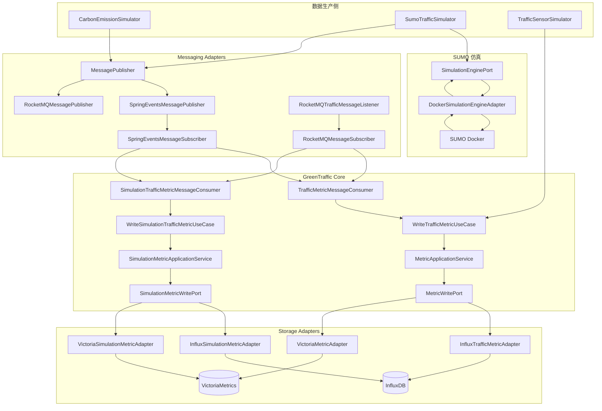
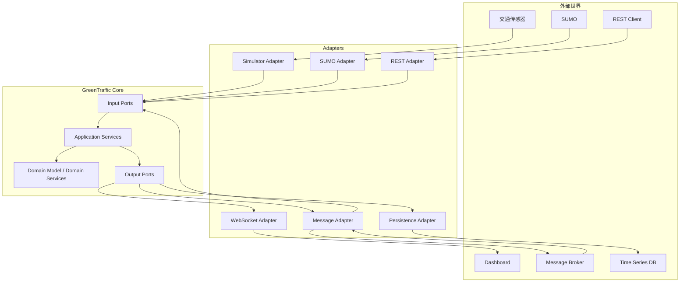
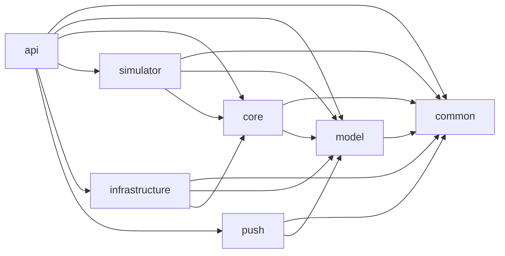
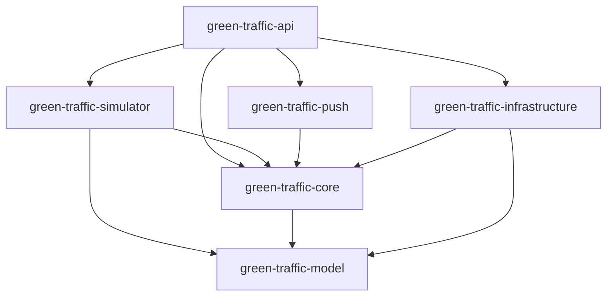

# GreenTraffic 城市交通碳排放实时监测与优化系统
## 系统架构设计、现状评估与后续开发规范

**文档版本：V3.0**  
**评审时间：2026-08-25**  
**架构目标：标准 Hexagonal Architecture（六边形架构 / Ports & Adapters）**  
**架构模式：Hexagonal Architecture + Event-Driven Architecture**  
**技术栈：Java 17 / Spring Boot 4 / Maven / Spring Events / RocketMQ / InfluxDB / VictoriaMetrics / SUMO**

> 迁移状态（Messaging）：能力端口 `MessagePublisher` / `MessageSubscriber` 已定义于 `green-traffic-core`，RocketMQ 和 Spring Events adapter 已实现于 `green-traffic-infrastructure`，装配由 `green-traffic-bootstrap` 控制。请参阅仓库根目录 `MIGRATION_MESSAGING.md` 获取剩余工作清单。

---

# 1. 文档目的

本文档基于当前 GreenTraffic 实际代码仓库进行架构评审，不以历史设计文档作为唯一依据，而是以当前源码、Maven Module、配置文件以及已经实现的 Adapter 为准。

本文档主要解决以下问题：

1. 当前系统是否符合最初确定的“标准六边形架构”；
2. 当前 Maven Module 与 Java Package 的职责是否合理；
3. 当前真实系统架构是什么；
4. 标准六边形架构应该如何落地到 GreenTraffic；
5. Dev / VM 环境为什么可以使用不同消息基础设施和时序数据库；
6. `CarbonEmissionSimulator`、`SumoTrafficSimulator` 的完整数据生产 → 异步消息 → 消息监听 → Core UseCase → 时序数据库写入链路；
7. 当前系统所谓的“异步”到底是不是真正异步；
8. InfluxDB / VictoriaMetrics 如何保持业务层无感知；
9. 后续新增功能时，新类应该放在哪个 Module、哪个 Package；
10. 当前架构存在的问题以及具体整改方案；
11. 后续如何逐步演进到真正生产级的交通碳排放监测、分析、预测、优化闭环。

---

# 2. 总体架构结论

## 2.1 当前架构结论

当前系统已经具备六边形架构的核心组成：

```text
                    External World
                         │
          ┌──────────────┼──────────────┐
          │              │              │
       Spring         RocketMQ        SUMO
       Events                         Docker
          │              │              │
          └────── Adapter / Adapter ───┘
                         │
                         ▼
                  ┌─────────────┐
                  │    Ports    │
                  └──────┬──────┘
                         │
                         ▼
                  ┌─────────────┐
                  │    Core     │
                  │             │
                  │ Application │
                  │   Domain    │
                  │   UseCase   │
                  └──────┬──────┘
                         │
                         ▼
                     Output Port
                         │
          ┌──────────────┼──────────────┐
          │              │              │
       InfluxDB    VictoriaMetrics   Future TSDB
```

因此：

> **GreenTraffic 已经具备标准六边形架构的基本结构。**

但是还没有达到“边界完全收敛”的程度。

---

# 3. 架构成熟度评估

| 维度 | 当前状态 | 评价 |
|---|---|---|
| Input Port | 已建立 | 🟢 |
| Output Port | 已建立 | 🟢 |
| Application Service | 已建立 | 🟢 |
| Message Publisher Port | 已建立 | 🟢 |
| Message Subscriber Port | 已建立 | 🟢 |
| Simulation Engine Port | 已建立 | 🟢 |
| Influx Adapter | 已建立 | 🟢 |
| VictoriaMetrics Adapter | 已建立 | 🟢 |
| RocketMQ Adapter | 已建立 | 🟢 |
| Spring Events Adapter | 已建立 | 🟢 |
| Docker SUMO Adapter | 已建立 | 🟢 |
| Dev / VM 基础设施切换 | 已建立 | 🟢 |
| Core Spring 解耦 | 已明显改善 | 🟢 |
| Core 纯业务化 | 基本成立，但模型边界仍需整理 | 🟡 |
| 真正异步 | 尚未完全成立 | 🟠 |
| Consumer 幂等 | 尚未真正完成 | 🔴 |
| Retry / DLQ | 只有基础骨架 | 🟠 |
| 消息 Schema 演进 | 初步具备 | 🟡 |
| Trace / Correlation | 字段已经存在，但链路未完整实现 | 🟡 |
| TSDB 数据模型统一 | 仍需完善 | 🟠 |
| API 与 Infrastructure 解耦 | 有明显问题 | 🟠 |
| Common 模块职责 | 偏杂 | 🟠 |
| Model 模块职责 | 需要收口 | 🟠 |

综合评价：

> **当前属于“架构方向正确、核心骨架成立、正在从原型向生产架构演进”的阶段。**

---

# 4. GreenTraffic 的核心架构思想

整个系统必须坚持一个核心原则：

> **业务决定“做什么”，Port 定义“需要什么能力”，Adapter 决定“怎么实现”。**

例如 Core 要写时序数据。

Core 只能知道：

```java
MetricWritePort (已迁移→ TrafficMetricStore)
```

Core 不应该知道：

```text
InfluxDB
VictoriaMetrics
TDengine
IoTDB
TimescaleDB
```

实际实现由 Infrastructure 决定：

```text
                    MetricWritePort
                          ▲
                          │
             ┌────────────┼────────────┐
             │            │            │
          InfluxDB     Victoria      TDengine
           Adapter      Adapter       Adapter
```

同样，Core 要发送消息：

```java
MessagePublisher
```

而不是：

```java
RocketMQTemplate
ApplicationEventPublisher
KafkaTemplate
RabbitTemplate
```

Infrastructure 决定：

```text
                 MessagePublisher
                       ▲
                       │
             ┌─────────┴─────────┐
             │                   │
     SpringEventsPublisher   RocketMQPublisher
```

这就是整个 GreenTraffic 最核心的架构原则：

> **业务能力稳定，外部技术可替换。**

---

# 5. 当前 Maven Module 架构

当前项目：

```text
green-traffic
│
├── green-traffic-common
├── green-traffic-model
├── green-traffic-simulator
├── green-traffic-core
├── green-traffic-push
├── green-traffic-api
└── green-traffic-infrastructure
```

另外：

```text
green-traffic-dashboard
green-traffic-doc
sumo-work
```

属于前端、文档以及仿真运行资源。

---

# 6. Module 职责定义

## 6.1 green-traffic-model

职责：

> 定义稳定的领域数据模型、值对象和基础领域结构。

推荐：

```text
green-traffic-model
└── com.greentraffic.model
    ├── entity
    │   ├── traffic
    │   ├── simulation
    │   └── ...
    ├── valueobject
    └── common
```

当前：

```text
SimulationTrafficMetric
EnergyRecord
BaseEntity
```

已经在 Model。

但是当前存在一个明确问题：

```text
TrafficMetric.java
```

实际上位于：

```text
green-traffic-common
└── com.greentraffic.model.entity.traffic
```

这不合理。

### 建议立即调整

把：

```text
green-traffic-common/src/main/java/com/greentraffic/model/entity/traffic/TrafficMetric.java
```

移动到：

```text
green-traffic-model/src/main/java/com/greentraffic/model/entity/traffic/TrafficMetric.java
```

这样：

```text
TrafficMetric
SimulationTrafficMetric
EnergyRecord
```

全部属于 Model。

---

# 7. green-traffic-common

当前：

```text
ApiResponse
AlertMessage
AlertRepository
TimezoneUtils
TrafficMetric
```

存在明显职责混杂。

`common` 最终应该只保留：

```text
真正跨模块、无业务归属的公共基础能力
```

例如：

```text
ApiResponse
TimezoneUtils
通用异常
通用常量
```

不建议继续向 Common 放：

```text
业务实体
业务 Repository
业务消息
业务告警
业务规则
```

---

# 8. AlertMessage / AlertRepository 的调整

当前：

```text
common.messaging.AlertMessage
common.repository.AlertRepository
```

不符合严格六边形设计。

推荐：

```text
AlertMessage
```

如果是业务领域对象：

```text
green-traffic-model
└── entity
    └── alert
        └── Alert.java
```

如果告警已经包含复杂业务行为，则进入：

```text
green-traffic-core
└── domain
    └── alert
```

而：

```text
AlertRepository
```

不应该放 Common。

推荐：

```text
green-traffic-core
└── port
    └── output
        └── AlertRepositoryPort.java
```

Infrastructure 再实现：

```text
green-traffic-infrastructure
└── persistence
    └── mysql
        └── MySqlAlertRepositoryAdapter.java
```

---

# 9. green-traffic-core

这是整个系统最重要的 Module。

目标结构：

```text
green-traffic-core
└── com.greentraffic.core
    │
    ├── application
    │
    ├── domain
    │   ├── traffic
    │   ├── carbon
    │   ├── optimization
    │   ├── prediction
    │   └── alert
    │
    └── port
        ├── input
        └── output
```

当前已经存在：

```text
application
port/input
port/output
```

这是非常正确的方向。

---

# 10. Core 当前已经完成的重要架构改进

当前 `MetricApplicationService` 已经没有：

```java
@Service
```

等 Spring 注解。

同时：

```text
ApplicationServiceConfiguration
```

已经移动到：

```text
green-traffic-infrastructure
```

负责 Bean 装配。

这意味着：

```text
Core
```

已经开始真正与：

```text
Spring Framework
```

解耦。

这是本次代码版本非常重要的一项架构进步。

当前：

```text
Infrastructure
      │
      ▼
ApplicationServiceConfiguration
      │
      ├── MetricApplicationService
      ├── SimulationMetricApplicationService
      └── TrafficMetricQueryApplicationService
```

这种方式是正确的。

---

# 11. green-traffic-simulator

Simulator 不属于业务 Core。

它的定位应该是：

> **数据生产端 / 输入适配器。**

当前：

```text
CarbonEmissionSimulator
SumoTrafficSimulator
TrafficSensorSimulator
```

属于数据源。

推荐：

```text
green-traffic-simulator
└── com.greentraffic.simulator
    ├── carbon
    ├── sumo
    ├── sensor
    └── scheduling
```

当前阶段不一定需要立即拆 Package，但长期建议这样整理。

---

# 12. green-traffic-infrastructure

这是外部技术实现层。

当前已经包含：

```text
messaging
persistence
simulation
config
```

整体方向正确。

推荐最终：

```text
green-traffic-infrastructure
└── com.greentraffic.infrastructure
    │
    ├── config
    │
    ├── messaging
    │   ├── springevents
    │   ├── rocketmq
    │   ├── converter
    │   ├── retry
    │   └── idempotency
    │
    ├── persistence
    │   ├── influxdb
    │   ├── victoriametrics
    │   └── mysql
    │
    └── simulation
        └── sumo
```

当前没有必要立刻拆成多个 Maven Module。

先做好 Package 边界即可。

---

# 13. green-traffic-api

API 是：

> Inbound Adapter + Composition Root。

负责：

```text
REST Controller
Spring Boot 启动
配置
Bean 装配
HTTP 参数转换
异常处理
Actuator
```

Controller 应该：

```text
HTTP Request
    ↓
Request DTO
    ↓
Input Port
    ↓
UseCase
```

不能：

```text
Controller
   ↓
InfluxDBClient
```

也不能：

```text
Controller
   ↓
RocketMQTemplate
```

---

# 14. 当前 API 层存在的问题

`GreenTrafficApplication` 当前直接注入：

```java
JdbcTemplate
```

并执行：

```sql
SELECT 1
```

这意味着应用启动入口直接接触数据库。

严格六边形架构下不建议这样做。

建议改为：

```text
Actuator Health
```

或者：

```text
infrastructure.health.DatabaseHealthIndicator
```

不要让：

```text
GreenTrafficApplication
```

承担基础设施健康检查。

---

# 15. green-traffic-push

当前基本属于预留模块。

未来定位：

```text
WebSocket Adapter
SSE Adapter
实时广播
Dashboard 推送
告警推送
```

Push 不应该放：

```text
碳排放算法
拥堵判断
优化算法
数据库写入
```

Push 只是：

```text
Core Event
   ↓
Push Adapter
   ↓
WebSocket
```

---

# 16. 当前真实系统架构图



---

# 17. 标准六边形目标架构图

当前架构是“模块驱动”的。

目标架构应该变成“业务中心驱动”。



这里有一个非常重要的区别：

> **Core 不应该围绕 InfluxDB、RocketMQ、SUMO 设计，而应该围绕“交通数据、碳排放、拥堵、预测、优化”设计。**

---

# 18. 当前 Module 依赖关系

当前大体是：



---

# 19. 目标 Module 依赖关系

最终应该尽可能收敛为：



关键原则：

```text
Core ← Infrastructure
```

这里的箭头表达的是：

> Infrastructure 依赖 Core 中的 Port，并实现 Port。

不是：

```text
Core → Infrastructure
```

---

# 20. CarbonEmissionSimulator 完整链路

当前：

```text
@Scheduled
     │
     ▼
CarbonEmissionSimulator
     │
     ├── vehicleCount
     ├── speed
     ├── co2
     └── TrafficMetric
             │
             ▼
    Message.of(...)
             │
             ▼
   CO2_EMISSION
             │
             ▼
    MessagePublisher
             │
       ┌─────┴─────┐
       │           │
      Dev          VM
       │           │
Spring Events   RocketMQ
       │           │
       └─────┬─────┘
             ▼
TrafficMetricMessageConsumer
             │
             ▼
WriteTrafficMetricUseCase
             │
             ▼
MetricApplicationService
             │
             ▼
MetricWritePort
             │
       ┌─────┴──────┐
       │            │
    Influx       Victoria
       │            │
      DB            DB
```

---

# 21. CarbonEmissionSimulator 当前的关键问题

当前代码：

```java
messagePublisher.publishAsync(msg);
```

实际上已经进行了修改，说明你正在向真正异步方向推进。

但是代码又存在：

```java
catch (NoUniqueBeanDefinitionException)
```

然后：

```java
messagePublisher.publish(msg);
```

这个 fallback 说明当前消息线程池配置存在 Bean 选择不稳定的问题。

更好的方式不是在业务生产者中捕获：

```text
NoUniqueBeanDefinitionException
```

而是：

> **把 TaskExecutor 的选择问题彻底封装到 Infrastructure Adapter 内。**

最终：

```java
messagePublisher.publishAsync(msg);
```

调用方不应该知道：

```text
有没有 TaskExecutor
有几个 TaskExecutor
使用哪个 TaskExecutor
```

---

# 22. CarbonEmissionSimulator 推荐最终结构

当前：

```text
CarbonEmissionSimulator
```

同时负责：

```text
定时调度
随机数据生成
碳排放计算
消息发布
```

建议逐步拆分：

```text
green-traffic-simulator
└── carbon
    ├── CarbonEmissionSimulator
    └── CarbonTrafficDataGenerator
```

Core：

```text
green-traffic-core
└── domain
    └── carbon
        ├── CarbonEmissionCalculator
        ├── CarbonEmissionFactor
        └── CarbonEmissionResult
```

最终：

```text
Scheduler
   ↓
DataGenerator
   ↓
TrafficMetric
   ↓
MessagePublisher
```

真正的碳排放业务算法：

```text
Core
```

而不是：

```text
Simulator
```

---

# 23. SumoTrafficSimulator 完整链路

当前实际结构：

```text
Scheduled
    │
    ▼
SumoTrafficSimulator
    │
    ▼
SimulationEnginePort
    │
    ▼
DockerSimulationEngineAdapter
    │
    ▼
Docker
    │
    ▼
SUMO
    │
    ├── network
    ├── route
    ├── simulation config
    └── tripinfo.xml
             │
             ▼
      parseTripInfo()
             │
             ▼
       List<SumoTripInfo>
             │
             ▼
    SumoTrafficMetricMapper
             │
             ▼
   SimulationTrafficMetric
             │
             ▼
      MessagePublisher
             │
             ▼
 TRAFFIC_DATA_BATCH
             │
       ┌─────┴─────┐
       │           │
      Dev          VM
       │           │
 Spring Events   RocketMQ
       │           │
       └─────┬─────┘
             ▼
SimulationTrafficMetricMessageConsumer
             │
             ▼
WriteSimulationTrafficMetricUseCase
             │
             ▼
SimulationMetricApplicationService
             │
             ▼
SimulationMetricWritePort
             │
       ┌─────┴──────────┐
       │                │
    Influx           Victoria
       │                │
      DB                 DB
```

---

# 24. SUMO 六边形设计是正确的

当前：

```java
SimulationEnginePort
```

是非常关键的抽象。

Simulator 不需要知道：

```text
SUMO 是 Docker
SUMO 是本机
SUMO 是远程服务器
SUMO 是 Kubernetes Pod
```

只需要：

```java
List<SumoTripInfo> run(SumoSimulationRequest request);
```

因此未来可以增加：

```text
DockerSumoSimulationAdapter
LocalSumoSimulationAdapter
RemoteSumoSimulationAdapter
CityFlowSimulationAdapter
MatSimSimulationAdapter
```

而不用修改：

```text
Core
SumoTrafficSimulator
```

这正是六边形架构的价值。

---

# 25. LocalSumoSimulationAdapter 当前问题

当前：

```java
public class LocalSumoSimulationAdapter {
}
```

是空类。

这意味着当前真正工作的 SUMO Adapter 是：

```text
DockerSimulationEngineAdapter
```

建议：

> 暂时删除空的 `LocalSumoSimulationAdapter`。

等真正实现本地 SUMO 后再创建。

否则会形成：

```text
代码看起来支持 Local SUMO
实际上没有实现
```

的架构假象。

---

# 26. Dev 环境设计

当前：

```yaml
messaging:
  type: events

traffic:
  storage:
    type: influx
```

所以：

```text
Producer
   ↓
MessagePublisher
   ↓
SpringEventsMessagePublisher
   ↓
ApplicationEventPublisher
   ↓
SpringEventsMessageSubscriber
   ↓
MessageConsumer
   ↓
UseCase
   ↓
MetricWritePort
   ↓
InfluxAdapter
   ↓
InfluxDB
```

Dev 的价值：

```text
不需要启动 RocketMQ
不需要 Broker
不需要 NameServer
IDE 单进程即可开发
```

因此 Dev 是：

> **进程内事件驱动开发环境。**

---

# 27. Dev 环境并不等价于可靠异步消息

需要特别强调：

```text
Spring ApplicationEvent
```

本身不是：

```text
RocketMQ
```

如果：

```java
applicationEventPublisher.publishEvent(...)
```

直接调用监听器，那么调用链仍然可以是：

```text
Producer
 ↓
publishEvent
 ↓
Listener
 ↓
Consumer
 ↓
Core
 ↓
DB
```

所以：

> **Spring Events = 解耦机制，不天然等于异步机制。**

---

# 28. Dev 真正异步架构

如果希望 Dev 与 VM 的“异步语义”尽量一致：

```text
CarbonEmissionSimulator
        │
        ▼
MessagePublisher.publishAsync()
        │
        ▼
SpringEventsMessagePublisher
        │
        ▼
messageTaskExecutor
        │
        ▼
ApplicationEventPublisher
        │
        ▼
SpringEventsMessageSubscriber
        │
        ▼
Consumer
```

当前工程已经存在：

```text
MessagingTaskExecutorConfiguration
```

这是正确方向。

但下一步应该：

> 把线程池选择和异常处理完全封装到 Adapter 内，而不是让 Simulator 处理 Bean 冲突。

---

# 29. VM 环境设计

当前：

```yaml
messaging:
  type: rocketmq

traffic:
  storage:
    type: victoria-metrics
```

完整链路：

```text
Simulator
   │
   ▼
MessagePublisher
   │
   ▼
RocketMQMessagePublisher
   │
   ▼
RocketMQ Broker
   │
   ▼
RocketMQTrafficMessageListener
   │
   ▼
RocketMQMessageSubscriber
   │
   ▼
normalizeMetricPayload()
   │
   ▼
TrafficMetricMessageConsumer
   │
   ▼
WriteTrafficMetricUseCase
   │
   ▼
MetricApplicationService
   │
   ▼
MetricWritePort
   │
   ▼
VictoriaMetricAdapter
   │
   ▼
BlockingQueue
   │
   ▼
Batch Flush
   │
   ▼
VictoriaMetrics
```

---

# 30. Dev / VM 双基础设施设计的核心思想

这个设计是正确的。

因为：

```text
业务系统
    │
    ▼
MessagePublisher
    │
    ├──────────────┐
    │              │
   Dev             VM
    │              │
Spring Events    RocketMQ
```

业务系统不关心：

```text
消息是 JVM 内存
还是 Broker
```

同样：

```text
MetricWritePort
      │
      ├─────────────┐
      │             │
     Dev            VM
      │             │
   InfluxDB    VictoriaMetrics
```

Core 也不关心：

```text
Influx
Victoria
```

这就是：

> **内部跨平台、跨基础设施的统一 Port 设计。**

---

# 31. 当前 VM 消息实现的一个重要问题

当前：

```text
RocketMQMessagePublisher
```

已经存在：

```java
publishAsync()
```

但：

```text
CarbonEmissionSimulator
SumoTrafficSimulator
```

如果调用的是：

```java
publish()
```

那么实际上使用：

```text
syncSend
```

而不是：

```text
asyncSend
```

因此要准确区分：

### 当前状态

```text
Dev
Spring Events
```

和：

```text
VM
RocketMQ
```

已经实现基础设施隔离。

但：

> **消息发送端是否异步，取决于调用的是 `publish()` 还是 `publishAsync()`。**

---

# 32. 建议统一消息生产入口

所有高频数据生产者：

```text
CarbonEmissionSimulator
SumoTrafficSimulator
TrafficSensorSimulator
未来 IoT Producer
```

统一：

```java
messagePublisher.publishAsync(message);
```

业务侧永远不要：

```java
rocketMQTemplate.asyncSend(...)
```

也不要：

```java
applicationEventPublisher.publishEvent(...)
```

业务侧只允许：

```java
MessagePublisher
```

---

# 33. Consumer 的正确职责

当前：

```text
TrafficMetricMessageConsumer
SimulationTrafficMetricMessageConsumer
```

整体方向正确。

Consumer 只负责：

```text
1. 接收 Message
2. 校验消息
3. Payload 转换
4. 构造 Command
5. 调用 UseCase
```

不能负责：

```text
❌ 碳排放算法
❌ 拥堵判断
❌ 优化算法
❌ 直接访问 InfluxDB
❌ 直接访问 VictoriaMetrics
❌ 执行 SUMO
```

---

# 34. 当前 RocketMQ Subscriber 的问题

当前：

```text
RocketMQMessageSubscriber
```

里面存在：

```text
normalizeMetricPayload()
```

负责把：

```text
Object
```

转换成：

```text
TrafficMetric
SimulationTrafficMetric
```

这个逻辑方向正确，但是应该进一步拆分。

推荐：

```text
green-traffic-infrastructure
└── messaging
    └── converter
        ├── TrafficMessageConverter
        └── SimulationTrafficMessageConverter
```

然后：

```text
RocketMQMessageSubscriber
```

只负责：

```text
Broker Message
    ↓
Message Dispatch
```

---

# 35. Spring Events Subscriber 也应该复用同一个 Converter

最终：

```text
SpringEvents
       │
       ▼
Message
       │
       ▼
MessageConverter
       │
       ▼
Domain Model
```

RocketMQ：

```text
RocketMQ
   │
   ▼
Message
   │
   ▼
MessageConverter
   │
   ▼
Domain Model
```

这样两个环境不会产生：

```text
Dev 一套转换逻辑
VM 一套转换逻辑
```

导致行为不一致。

---

# 36. Message 模型评价

当前 `Message<T>` 已经包含：

```text
messageId
messageType
topic
tag
key
payload
headers
timestamp
schemaVersion
source
traceId
correlationId
```

这是非常好的基础。

建议保留：

```text
messageId
messageType
schemaVersion
source
traceId
correlationId
timestamp
payload
```

这些是未来生产级消息系统必须具备的。

---

# 37. Message Schema 建议

建议定义：

```text
schemaVersion
```

例如：

```text
1.0
1.1
2.0
```

未来：

```text
TrafficMetric v1
TrafficMetric v2
```

消费者根据：

```text
messageType
schemaVersion
```

进行转换。

---

# 38. Message Idempotency

生产环境建议：

```text
At-Least-Once Delivery
+
Idempotent Consumer
```

而不是追求所谓：

```text
Exactly Once
```

最终效果：

```text
消息可以重复
业务结果不能重复
```

---

# 39. 当前可靠性实现的问题

当前存在：

```text
MessageReliabilityService
InMemoryMessageReliabilityService
```

但它主要解决的是：

```text
Producer 发送侧
```

并且：

```text
InMemory
```

不能承担生产级可靠性。

例如 JVM 重启：

```text
sent Set
```

全部消失。

因此：

> 当前可靠性代码属于“可靠性框架骨架”，还不能视为生产级幂等机制。

---

# 40. 推荐的幂等架构

Core 定义：

```java
public interface MessageIdempotencyPort {

    boolean alreadyProcessed(String messageId);

    void markProcessed(String messageId);
}
```

Infrastructure：

```text
RedisMessageIdempotencyAdapter
```

或者：

```text
MySqlMessageIdempotencyAdapter
```

Consumer：

```text
Receive
   │
   ▼
alreadyProcessed?
   │
   ├── YES → ACK / Ignore
   │
   └── NO
        │
        ▼
      UseCase
        │
        ▼
  markProcessed
```

---

# 41. RocketMQ Retry / DLQ

目标：

```text
RocketMQ
   │
   ▼
Consumer
   │
   ▼
Idempotency
   │
   ▼
UseCase
   │
   ├── Success
   │      ↓
   │     ACK
   │
   └── Failure
          ↓
        Retry
          ↓
        Retry
          ↓
         DLQ
```

建议增加：

```text
green-traffic-infrastructure
└── messaging
    └── rocketmq
        ├── consumer
        │   ├── RocketMQTrafficMessageListener
        │   ├── RocketMQMessageSubscriber
        │   └── RocketMQConsumeErrorHandler
        │
        ├── retry
        │   └── MessageRetryPolicy
        │
        └── idempotency
            └── ...
```

---

# 42. InfluxDB 架构

当前：

```text
MetricWritePort
      │
      ▼
InfluxTrafficMetricAdapter
      │
      ▼
InfluxDB
```

仿真：

```text
SimulationMetricWritePort
      │
      ▼
InfluxSimulationMetricAdapter
      │
      ▼
InfluxDB
```

这是标准六边形的正确实现。

---

# 43. VictoriaMetrics 架构

当前：

```text
MetricWritePort
      │
      ▼
VictoriaMetricAdapter
      │
      ▼
BlockingQueue
      │
      ▼
Batch
      │
      ▼
HTTP
      │
      ▼
VictoriaMetrics
```

仿真：

```text
SimulationMetricWritePort
      │
      ▼
VictoriaSimulationMetricAdapter
      │
      ▼
BlockingQueue
      │
      ▼
Batch
      │
      ▼
VictoriaMetrics
```

整体设计正确。

---

# 44. VictoriaMetrics BlockingQueue 的定位

需要明确：

```text
BlockingQueue
```

只是：

> **写入性能缓冲。**

不是：

> **消息可靠性机制。**

如果：

```text
JVM Crash
```

那么：

```text
BlockingQueue
```

中的数据可能丢失。

因此：

```text
RocketMQ
```

负责：

```text
消息可靠性
```

而：

```text
VictoriaMetricAdapter
```

负责：

```text
批量
协议转换
HTTP
重试
```

职责必须分开。

---

# 45. Influx / Victoria 的统一抽象

Core 永远只看到：

```text
MetricWritePort
MetricQueryPort
SimulationMetricWritePort
```

因此：

```text
                    MetricWritePort
                         ▲
             ┌───────────┴───────────┐
             │                       │
    InfluxTrafficMetricAdapter   VictoriaMetricAdapter
             │                       │
          InfluxDB              VictoriaMetrics
```

仿真：

```text
              SimulationMetricWritePort
                         ▲
             ┌───────────┴───────────┐
             │                       │
 InfluxSimulationMetricAdapter   VictoriaSimulationMetricAdapter
```

这一部分建议继续保持，不要让 Core 出现：

```java
InfluxDBClient
RestTemplate
Victoria
```

等技术实现。

---

# 46. 时序数据 Schema 建议

后续统一交通指标维度：

```text
timestamp
source
cityId
areaId
roadId
laneId
direction
vehicleType
simulationId
```

实时指标：

```text
TrafficMetric
├── roadId
├── direction
├── vehicleType
├── trafficFlow
├── averageSpeed
├── co2Emission
├── location
└── timestamp
```

仿真指标：

```text
SimulationTrafficMetric
├── simulationId
├── roadId
├── direction
├── vehicleType
├── vehicleCount
├── averageSpeed
├── totalCo2Emission
├── averageTravelTime
├── averageWaitingTime
├── averageTimeLoss
├── totalRouteLength
└── timestamp
```

---

# 47. 碳排放算法应该放哪里？

绝对不要长期放：

```text
green-traffic-simulator
```

也不要放：

```text
green-traffic-infrastructure
```

应该：

```text
green-traffic-core
└── domain
    └── carbon
        ├── CarbonEmissionCalculator.java
        ├── CarbonEmissionFactor.java
        ├── CarbonEmissionResult.java
        └── CarbonEmissionPolicy.java
```

例如：

```java
public interface CarbonEmissionCalculator {

    CarbonEmissionResult calculate(TrafficMetric metric);
}
```

Simulator 只是产生数据。

真正的业务算法属于：

```text
Core Domain
```

---

# 48. 如果碳排放因子来自数据库

Core：

```text
core.port.output.carbon.EmissionFactorQueryPort
```

Infrastructure：

```text
infrastructure.persistence.mysql.MySqlEmissionFactorAdapter
```

调用链：

```text
CarbonEmissionCalculator
       │
       ▼
EmissionFactorQueryPort
       ▲
       │
MySqlEmissionFactorAdapter
```

Core 不知道 MySQL。

---

# 49. 新增“交通拥堵识别”

推荐：

```text
green-traffic-core
└── domain
    └── traffic
        ├── CongestionAnalyzer.java
        └── CongestionLevel.java
```

Application：

```text
core.application
└── CongestionAnalysisApplicationService.java
```

Input Port：

```text
core.port.input
└── AnalyzeCongestionUseCase.java
```

如果需要历史数据：

```text
MetricQueryPort
```

直接复用。

不要：

```java
CongestionAnalyzer
    ↓
InfluxDBClient
```

---

# 50. 新增“碳排放预测”

推荐：

```text
core
├── application
│   └── CarbonEmissionPredictionApplicationService
│
├── domain
│   └── prediction
│       ├── CarbonEmissionPredictor
│       ├── PredictionResult
│       └── PredictionModel
│
└── port
    └── output
        └── prediction
            └── PredictionModelPort
```

Infrastructure：

```text
infrastructure
└── prediction
    ├── PythonPredictionAdapter
    ├── ONNXPredictionAdapter
    └── RemotePredictionServiceAdapter
```

这样以后算法模型可以替换。

---

# 51. 新增“交通优化”

Core：

```text
core.domain.optimization
```

例如：

```text
TrafficOptimizationStrategy
SignalTimingOptimization
LaneOptimization
RouteOptimization
OptimizationResult
```

如果未来需要向信号机下发：

```text
core.port.output
└── TrafficControlPort
```

Infrastructure：

```text
infrastructure.trafficcontrol
└── TrafficSignalControllerAdapter
```

---

# 52. 新增“告警”

Core：

```text
core.domain.alert
```

Input：

```text
CreateTrafficAlertUseCase
```

Output：

```text
AlertPublisherPort
```

Infrastructure：

```text
infrastructure.messaging
```

实现：

```text
RocketMQAlertPublisher
WebSocketAlertPublisher
EmailAlertPublisher
```

---

# 53. 新增 Redis

Core：

```text
core.port.output.cache.CachePort
```

Infrastructure：

```text
infrastructure.cache.redis.RedisCacheAdapter
```

禁止：

```text
Core
 ↓
RedisTemplate
```

---

# 54. 新增 Kafka

Core 不变。

Infrastructure：

```text
infrastructure.messaging.kafka
└── KafkaMessagePublisher
└── KafkaMessageSubscriber
```

配置：

```yaml
messaging:
  type: kafka
```

---

# 55. 新增 RabbitMQ

Core：

```text
MessagePublisher
MessageSubscriber
```

Infrastructure：

```text
infrastructure.messaging.rabbitmq
├── RabbitMqMessagePublisher
└── RabbitMqMessageSubscriber
```

Core 无需任何修改。

---

# 56. 新增 TDengine / IoTDB

Core：

```text
MetricWritePort
MetricQueryPort
```

Infrastructure：

```text
infrastructure.persistence.tdengine
└── TdengineMetricAdapter
```

或者：

```text
infrastructure.persistence.iotdb
└── IotdbMetricAdapter
```

配置：

```yaml
traffic:
  storage:
    type: tdengine
```

或：

```yaml
traffic:
  storage:
    type: iotdb
```

---

# 57. 新增功能时的 Module 规则

| 功能 | Module | Package |
|---|---|---|
| 领域实体 | model | `com.greentraffic.model.*` |
| Value Object | model / core.domain | 按业务行为判断 |
| UseCase | core | `core.port.input` |
| Application Service | core | `core.application` |
| 业务算法 | core | `core.domain.*` |
| Output Port | core | `core.port.output` |
| REST Controller | api | `api.controller` |
| Request DTO | api | `api.controller.request` |
| WebSocket | push | `push.websocket` |
| Simulator | simulator | `simulator.*` |
| SUMO Adapter | infrastructure | `infrastructure.simulation.sumo` |
| RocketMQ Adapter | infrastructure | `infrastructure.messaging.rocketmq` |
| Spring Event Adapter | infrastructure | `infrastructure.messaging.springevents` |
| Influx Adapter | infrastructure | `infrastructure.persistence.influxdb` |
| Victoria Adapter | infrastructure | `infrastructure.persistence.victoriametrics` |
| MySQL Adapter | infrastructure | `infrastructure.persistence.mysql` |
| Redis Adapter | infrastructure | `infrastructure.cache.redis` |
| 通用无业务工具 | common | `common.util` |
| API 通用响应 | common | `common.api` |
| Dashboard | dashboard | 前端 |
| SUMO 文件 | sumo-work | 仿真资源 |

---

# 58. 新增类时最重要的判断方法

不要首先问：

> “这个类放哪个 Package？”

首先问：

> **这个类是在表达业务，还是在连接外部世界？**

如果是：

```text
表达业务
```

进入：

```text
model
core.domain
core.application
core.port
```

如果是：

```text
连接外部世界
```

进入：

```text
infrastructure
api
push
simulator
```

这是比记住包名更重要的规则。

---

# 59. 推荐最终 Package

```text
com.greentraffic
│
├── model
│   ├── entity
│   │   ├── traffic
│   │   ├── simulation
│   │   └── alert
│   └── common
│
├── core
│   ├── application
│   │
│   ├── domain
│   │   ├── traffic
│   │   ├── carbon
│   │   ├── optimization
│   │   ├── prediction
│   │   └── alert
│   │
│   └── port
│       ├── input
│       └── output
│
├── infrastructure
│   ├── messaging
│   │   ├── springevents
│   │   ├── rocketmq
│   │   ├── converter
│   │   ├── retry
│   │   └── idempotency
│   │
│   ├── persistence
│   │   ├── influxdb
│   │   ├── victoriametrics
│   │   └── mysql
│   │
│   ├── simulation
│   │   └── sumo
│   │
│   └── config
│
├── simulator
│   ├── carbon
│   ├── sumo
│   └── sensor
│
├── api
│   └── controller
│
└── push
    └── websocket
```

---

# 60. 当前需要优先整改的问题

## P0-1：敏感配置不能明文保存

当前配置中存在：

```text
MySQL password
InfluxDB token
```

应该全部改成：

```yaml
password: ${MYSQL_PASSWORD}
token: ${INFLUXDB_TOKEN}
```

由：

```text
Environment
Docker Secret
Kubernetes Secret
CI/CD Secret
Vault
```

提供。

---

# 61. P0-2：生产级消息幂等

当前：

```text
InMemoryMessageReliabilityService
```

只能作为：

```text
开发 / 测试骨架
```

生产环境需要：

```text
Redis
MySQL
或者 Inbox
```

来实现持久化幂等。

---

# 62. P0-3：消息 Retry / DLQ

需要完整实现：

```text
Consume
 ↓
Business
 ↓
Success → ACK
 ↓
Failure
 ↓
Retry
 ↓
Retry
 ↓
DLQ
```

并且：

```text
DLQ
```

需要支持：

```text
查询
人工重放
自动重试
失败原因
原始 messageId
traceId
```

---

# 63. P0-4：彻底统一 publishAsync

所有高频 Producer：

```text
CarbonEmissionSimulator
SumoTrafficSimulator
TrafficSensorSimulator
```

统一：

```java
publishAsync()
```

不要在业务生产者中自行处理：

```text
TaskExecutor
NoUniqueBeanDefinitionException
```

这些全部属于：

```text
Infrastructure
```

---

# 64. P1：移动 TrafficMetric

当前：

```text
common
└── model.entity.traffic.TrafficMetric
```

修改：

```text
model
└── entity
    └── traffic
        └── TrafficMetric
```

然后逐步解除：

```text
model → common
```

依赖。

最终：

```text
model
```

应该成为纯模型模块。

---

# 65. P1：整理 AlertRepository

当前：

```text
common.repository.AlertRepository
```

改为：

```text
core.port.output.alert.AlertRepositoryPort
```

实现：

```text
infrastructure.persistence.mysql.MySqlAlertRepositoryAdapter
```

---

# 66. P1：API 移除直接 JDBC

当前：

```java
GreenTrafficApplication
    ↓
JdbcTemplate
```

建议删除。

数据库健康检查使用：

```text
Spring Boot Actuator
```

或：

```text
DatabaseHealthIndicator
```

---

# 67. P1：测试 Controller 隔离

当前：

```text
TimeSeriesDataTestController
VmTestController
```

属于测试接口。

不要长期存在正式应用：

```text
src/main/java
```

建议：

```text
src/test
```

或者：

```text
@Profile("demo")
```

正式环境禁用。

---

# 68. P1：SUMO Scheduler 解耦

当前：

```text
@Scheduled
 ↓
SUMO
 ↓
docker run
 ↓
等待仿真完成
```

如果 SUMO 运行：

```text
300 秒
```

那么调度线程会长期被占用。

建议：

```text
Scheduler
 ↓
SimulationJob
 ↓
TaskExecutor
 ↓
SUMO
```

但是：

> 不要在 Core 内部做异步。

异步属于：

```text
Simulator / Infrastructure
```

---

# 69. P1：统一 Message Converter

将：

```text
normalizeMetricPayload()
```

从：

```text
RocketMQMessageSubscriber
```

抽取到：

```text
infrastructure.messaging.converter
```

形成：

```text
TrafficMessageConverter
SimulationTrafficMessageConverter
```

---

# 70. P1：统一时序数据 Schema

特别是：

```text
Influx
VictoriaMetrics
```

必须定义统一：

```text
measurement / metric
tags / labels
fields
timestamp
```

不能出现：

```text
Influx 一套字段
VM 又一套字段
```

最后再在 Query Adapter 里强行转换。

---

# 71. P1：VictoriaMetrics 查询模型

当前 VM 写入：

```text
Influx Line Protocol
```

查询：

```text
PromQL
```

技术上是可以的，但必须明确最终数据模型。

建议定义：

```text
traffic_metric
```

或者进一步拆成：

```text
traffic_flow
traffic_average_speed
traffic_co2_emission
```

Labels：

```text
roadId
direction
vehicleType
location
simulationId
```

Fields / Values：

```text
trafficFlow
averageSpeed
co2Emission
```

建立统一的：

```text
TimeSeriesSchema
```

规范。

---

# 72. P2：Inbox / Outbox

如果未来系统从：

```text
监测
```

进入：

```text
交通控制
```

建议引入：

```text
Inbox Pattern
Outbox Pattern
```

例如：

```text
RocketMQ
   ↓
Inbox
   ↓
Core
   ↓
Business DB
   ↓
Outbox
   ↓
Message
```

这样可以解决：

```text
消息 ACK
数据库事务
事件发布
```

之间的一致性问题。

---

# 73. P2：领域事件

随着系统功能增长，建议逐步形成：

```text
TrafficDataReceived
TrafficDataProcessed
CarbonEmissionCalculated
CongestionDetected
CarbonEmissionExceeded
OptimizationGenerated
TrafficOptimizationApplied
```

领域事件。

但不要一开始就把所有事情都做成 Event。

原则：

> **跨边界、异步、解耦的事情使用事件；Core 内部简单业务流程优先保持同步。**

---

# 74. 推荐的标准消息链路

最终：

```text
┌─────────────────────┐
│ Data Producer       │
│                     │
│ Sensor / SUMO / IoT │
└──────────┬──────────┘
           │
           ▼
   MessagePublisher
           │
           ▼
    MessageEnvelope
           │
     ┌─────┴─────┐
     │           │
   Dev           VM
     │           │
Async Event    RocketMQ
     │           │
     └─────┬─────┘
           ▼
      MessageConsumer
           │
           ▼
        Validate
           │
           ▼
      Idempotency
           │
           ▼
        Command
           │
           ▼
        UseCase
           │
           ▼
     Domain Logic
           │
           ▼
       Output Port
           │
           ▼
    Persistence Adapter
           │
           ▼
          TSDB
```

---

# 75. GreenTraffic 最终业务闭环

GreenTraffic 最终不能只停留在：

```text
采集 → 存储 → 展示
```

应该形成：

```text
             Traffic Data
                   │
                   ▼
           Traffic Analysis
                   │
                   ▼
          Carbon Calculation
                   │
                   ▼
            Traffic State
                   │
          ┌────────┴────────┐
          │                 │
       Alert            Prediction
          │                 │
          └────────┬────────┘
                   ▼
              Optimization
                   │
                   ▼
         Recommendation / Control
                   │
                   ▼
            Traffic Change
                   │
                   ▼
              New Data
                   │
                   └───────────────↺
```

这才真正符合：

> **城市交通碳排放实时监测与优化系统**

这个产品定位。

---

# 76. 后续功能开发规范

以后增加任何功能，都按照下面流程。

## 第一步：先定义业务能力

例如：

```text
“识别路口拥堵”
```

先定义：

```text
AnalyzeCongestionUseCase
```

而不是先创建：

```text
InfluxCongestionService
```

---

## 第二步：定义 Input Port

```text
core.port.input
└── AnalyzeCongestionUseCase
```

---

## 第三步：定义 Application Service

```text
core.application
└── CongestionAnalysisApplicationService
```

---

## 第四步：定义 Domain Logic

```text
core.domain.traffic
└── CongestionAnalyzer
```

---

## 第五步：如果需要外部数据，再定义 Output Port

```text
core.port.output
└── MetricQueryPort
```

---

## 第六步：Infrastructure 实现 Adapter

```text
infrastructure.persistence.*
```

---

## 第七步：最后才做 Controller / MQ / WebSocket

也就是：

```text
业务
 ↓
Port
 ↓
Core
 ↓
Adapter
 ↓
外部技术
```

而不是：

```text
Controller
 ↓
数据库
 ↓
业务
```

---

# 77. 测试规范

最终需要形成四层测试。

## 第一层：Domain Test

```text
CarbonEmissionCalculatorTest
CongestionAnalyzerTest
OptimizationStrategyTest
```

特点：

```text
不启动 Spring
不访问数据库
不访问 MQ
```

---

## 第二层：Application Test

```text
MetricApplicationServiceTest
SimulationMetricApplicationServiceTest
```

Mock：

```text
MetricWritePort
MetricQueryPort
```

---

## 第三层：Infrastructure Test

```text
InfluxTrafficMetricAdapterTest
VictoriaMetricAdapterTest
RocketMQMessagePublisherTest
RocketMQMessageSubscriberTest
DockerSimulationEngineAdapterTest
```

---

## 第四层：E2E Test

至少覆盖：

```text
CarbonEmissionSimulator
 ↓
Message
 ↓
Consumer
 ↓
Core
 ↓
TSDB
```

以及：

```text
SumoTrafficSimulator
 ↓
SUMO
 ↓
Message
 ↓
Consumer
 ↓
Core
 ↓
TSDB
```

---

# 78. 建议的实施路线

## Phase 1：架构收口

优先级：P0

```text
1. 外置密码 / Token
2. TrafficMetric 移入 model
3. AlertRepository 移入 core.port.output
4. API 删除直接 JdbcTemplate
5. 删除/隔离 Test Controller
6. 统一 publishAsync
7. 消除业务侧 TaskExecutor 异常处理
```

---

# 79. Phase 2：消息生产化

优先级：P0 / P1

```text
1. RocketMQ Retry
2. ACK
3. DLQ
4. Consumer Idempotency
5. Message Converter
6. Schema Version
7. traceId
8. correlationId
9. Message Monitoring
```

---

# 80. Phase 3：时序数据生产化

优先级：P1

```text
1. 统一 Metric Schema
2. Influx Schema
3. VictoriaMetrics Schema
4. 查询模型统一
5. Batch Flush
6. Retry
7. 数据质量监控
8. 写入延迟监控
```

---

# 81. Phase 4：交通业务能力

优先级：P1 / P2

```text
1. 拥堵识别
2. 碳排放计算
3. 异常检测
4. 告警
5. 趋势分析
6. 排行
7. 路口评分
```

---

# 82. Phase 5：智能优化

优先级：P2 / P3

```text
1. 碳排放预测
2. 交通流预测
3. 信号配时优化
4. 路径优化
5. 多目标优化
6. SUMO 闭环验证
```

---

# 83. 最终推荐架构

```text
                         ┌─────────────────────┐
                         │     Dashboard       │
                         └──────────┬──────────┘
                                    │
                             REST / WebSocket
                                    │
                    ┌───────────────┴──────────────┐
                    │                              │
             green-traffic-api             green-traffic-push
                    │                              │
                    └───────────────┬──────────────┘
                                    │
                                    ▼
                         ┌────────────────────┐
                         │   GREEN TRAFFIC    │
                         │       CORE         │
                         │                    │
                         │ Application        │
                         │ Domain             │
                         │ Input Port         │
                         │ Output Port        │
                         └─────────┬──────────┘
                                   │
                       ┌───────────┼───────────┐
                       │           │           │
                       ▼           ▼           ▼
                  Messaging    Storage     Simulation
                    Port         Port          Port
                       ▲           ▲           ▲
                       │           │           │
             ┌─────────┴───┐ ┌────┴─────┐ ┌──┴──────────┐
             │             │ │          │ │             │
          Spring        RocketMQ   InfluxDB   Victoria   SUMO
          Events                    │        Metrics
             │                      │
             └──────────────────────┘

                    green-traffic-infrastructure
```

---

# 84. 最终架构原则

GreenTraffic 后续所有开发必须遵守以下 10 条原则：

### 原则 1

**Core 不依赖具体基础设施。**

---

### 原则 2

**业务逻辑进入 Core，技术实现进入 Infrastructure。**

---

### 原则 3

**外部系统必须通过 Port 进入或离开系统。**

---

### 原则 4

**Simulator 是数据生产 Adapter，不是业务 Core。**

---

### 原则 5

**InfluxDB、VictoriaMetrics、TDengine、IoTDB 对 Core 都应该是透明的。**

---

### 原则 6

**Spring Events、RocketMQ、Kafka、RabbitMQ 对 Core 都应该是透明的。**

---

### 原则 7

**Consumer 只负责消息接收、转换和调用 UseCase。**

---

### 原则 8

**高频消息使用异步发布，业务内部保持同步、可测试。**

---

### 原则 9

**生产消息系统采用 At-Least-Once + Idempotent Consumer。**

---

### 原则 10

**任何新功能先定义业务能力，再决定技术实现。**

---

# 85. 最终结论

GreenTraffic 当前已经完成了最重要的一步：

> **从传统“Controller → Service → Database”的技术驱动架构，开始转向“Core → Port → Adapter”的业务驱动架构。**

尤其当前已经存在：

```text
MessagePublisher
MessageSubscriber
MetricWritePort
MetricQueryPort
SimulationMetricWritePort
SimulationEnginePort
```

以及：

```text
SpringEvents Adapter
RocketMQ Adapter
InfluxDB Adapter
VictoriaMetrics Adapter
Docker SUMO Adapter
```

说明整个系统的架构方向已经成立。

当前最需要做的不是继续增加更多 Module，而是：

```text
收口边界
    ↓
统一消息模型
    ↓
真正异步
    ↓
补齐幂等 / Retry / DLQ
    ↓
统一时序 Schema
    ↓
整理 Model / Common
    ↓
强化 Core Domain
    ↓
形成交通 → 碳排放 → 预测 → 优化闭环
```

最终 GreenTraffic 应该形成：

```text
                 ┌───────────────┐
                 │ Traffic Data  │
                 └───────┬───────┘
                         ↓
                ┌────────────────┐
                │ Traffic Core   │
                └───────┬────────┘
                        ↓
              ┌───────────────────┐
              │ Carbon Calculation│
              └────────┬──────────┘
                       ↓
             ┌────────────────────┐
             │ State / Alert      │
             └─────────┬──────────┘
                       ↓
             ┌────────────────────┐
             │ Prediction         │
             └─────────┬──────────┘
                       ↓
             ┌────────────────────┐
             │ Optimization       │
             └─────────┬──────────┘
                       ↓
             ┌────────────────────┐
             │ Recommendation /   │
             │ Traffic Control    │
             └─────────┬──────────┘
                       ↓
                 Traffic Change
                       │
                       └──────────────↺
```

**最终架构目标不是“为了六边形而六边形”，而是让 GreenTraffic 可以在不修改核心业务代码的情况下，自由替换消息系统、时序数据库、仿真引擎、预测模型和部署基础设施。**